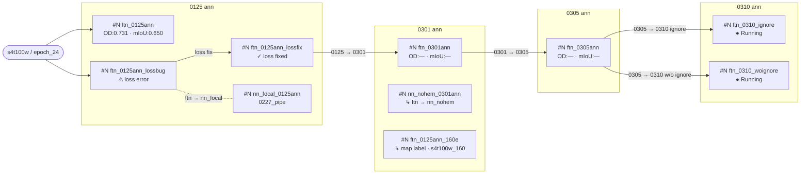
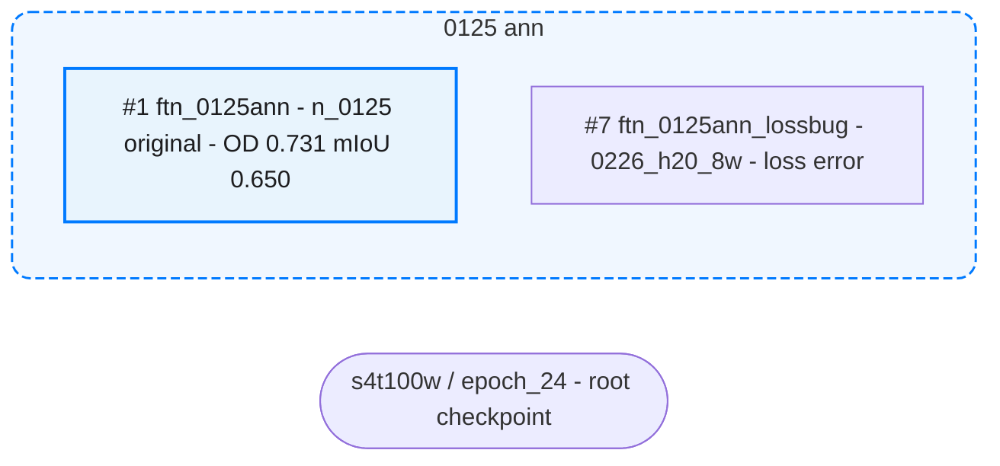

# Experiment Recorder

Track experiment lineage, register model snapshots, compare upstream/downstream pairs, and generate Feishu comparison docs + local Mermaid mind maps.

## Files

| File | Purpose |
|------|---------|
| `model_eval_results/experiment_registry.json` | Central registry of all experiments, edges, and Feishu doc links |
| `model_eval_results/experiment_tree.md` | Mermaid source — annotation-version column layout |
| `model_eval_results/experiment_tree.html` | Apple-style HTML page embedding SVG + collapsible Mermaid source |
| `model_eval_results/experiment_tree.svg` | SVG output — vector, used by HTML page |
| `model_eval_results/experiment_tree.png` | PNG output — regenerate with `python model_eval_results/gen_tree.py` |
| `model_eval_results/gen_tree.py` | Matplotlib-based PNG+SVG generator (pixel-precise column alignment) |
| `model_eval_results/*/epoch_*/summary.json` | Per-snapshot metrics (read by `/model-results-grabber`) |
| `model_eval_results/*/epoch_*/fs_metrics.csv` | Per-class FS metrics (CSV) |
| `mmdet3d/projects/flatformer/configs/ft_trace/**/*.py` | Config files for diff detection |

## Registry Schema

`model_eval_results/experiment_registry.json`:

```json
{
  "version": 1,
  "root_checkpoint": "flat_s4_tune_iter_100w/epoch_24.pth",
  "experiments": {
    "<experiment_id>": {
      "experiment_id": "<id>",
      "display_name": "<human-readable name>",
      "model_names": ["<model_eval_results dir name(s)>"],
      "config_path": "<path to primary config .py>",
      "seg_head_variant": "<ftn|nn_focal|nn_nohem|...>",
      "ann_version": "<0125|0301|0305|0310_ignore|...>",
      "key_config_diffs": { "ann_file": "...", "loss_seg": "..." },
      "metrics_snapshot": {
        "epoch": 24,
        "od_overall": 0.731,
        "fs_avg_miou": 0.650,
        "fs_avg_f1": 0.739
      },
      "feishu_comparison_docs": {},
      "snapshot_dir": "model_eval_results/<model>/epoch_<N>",
      "status": "completed|submitted|running|failed",
      "work_dir": "/high_perf_store3/.../pth_dir/<basename>/",
      "volc_task_id": "<task_id from submit output>"
    }
  },
  "edges": [
    {
      "upstream": "<exp_id>",
      "downstream": "<exp_id>",
      "diff_type": "ann_version|seg_head_variant|mixed|inherit",
      "diff_summary": "<short human-readable diff>",
      "is_inherit": false,
      "feishu_doc_url": null
    }
  ]
}
```

## Experiment ID Convention

Derived from `{seg_head_variant}_{ann_version}`:
- `ftn_0125ann` — FTN head, 0125 annotation
- `nn_focal_0125ann` — NN Focal head, 0125 annotation
- `nn_nohem_0125ann` — NN NoHEM head, 0125 annotation
- `ftn_0301ann` — FTN head, 0301 annotation
- `ftn_0310_ignore` — FTN head, 0310 annotation with ignore variant

## Model Name to Experiment ID Mapping

Parse model directory names from `model_eval_results/`:

| Pattern in model_name | seg_head_variant | ann_version hint |
|---|---|---|
| `_n_0125` or `_ftn_0125` | `ftn` | `0125` |
| `_nn_focal_` | `nn_focal` | from date suffix or config |
| `_nn_nohem_` or `_n_nohem_` | `nn_nohem` | from date suffix or config |
| `_n_focal_` | `n_focal` | from date suffix or config |

When ambiguous, read the config file's `_base_` chain to determine head variant, and `ann_file` to determine annotation version.

## Upstream-Downstream Rules

1. **Same seg_head, different ann_version**: Earlier date is upstream (e.g., `ftn_0125ann` -> `ftn_0301ann`) — `is_inherit=False`
2. **Same ann_version, different seg_head**: `ftn` is the baseline upstream (e.g., `ftn_0125ann` -> `nn_focal_0125ann`) — `is_inherit=False`
3. **Inherit/freeze relationship**: Downstream loads upstream weights with `--freeze-resume` or component freezing, training only a subset of modules (e.g., `ftn_5105_weight` -> `ftground_ftn` where only seg_head trains) — `is_inherit=True`, `diff_type="inherit"`
4. **Mixed**: Both differ — classify as `mixed`, require manual edge via `add-edge`

### Detecting Inherit Relationships

Check experiment metadata to determine if `is_inherit=True`:

- **YAML Entrypoint** contains `--freeze-resume` flag
- **Config file** has explicit `frozen_stages` or module freezing
- **Description/notes** mention "freeze backbone", "train seg_head only", "weight-only"
- **Experiment naming** includes `_wt_only`, `_weight_variant`, `ftground_*` (ftground experiments freeze encoder)

When `is_inherit=True`, the edge should be drawn with the inherit arrow style in `gen_tree.py` (see Arrow Styles section).

## Commands

### `record <model_name>`

Register one model snapshot into the registry.

1. Locate `model_eval_results/<model_name>/epoch_*/` — find the latest epoch dir
2. Read `summary.json` if it exists; extract `meta`, `od`, `fs`, `provenance`
3. If no `summary.json`, note metrics as null (user should run `/model-results-grabber` first)
4. Read the config file from `provenance.config_file` path mapping or scan `mmdet3d/projects/flatformer/configs/ft_trace/` for matching name
5. Parse `seg_head_variant` and `ann_version` from model name + config
6. Derive `experiment_id` as `{seg_head_variant}_{ann_version}ann`
7. Add to `experiments` in registry
8. Auto-detect edges: compare with all existing experiments using upstream-downstream rules + inherit detection (check if `provenance.load_from` path matches any existing experiment's work_dir)
9. Save registry, then run `update-tree`

### `record-all`

Scan all `model_eval_results/*/epoch_*/` directories. For each not yet in registry, run the `record` logic. Skip directories that are already registered.

### `placeholder <work_dir> [--config <config_path>] [--task-id <volc_task_id>]`

Create a minimal registry entry for a newly submitted job. Called automatically by `/job-uploader` after successful submission.

**The `work_dir` basename is the unique key** — it becomes the `model_name` that will later appear in `model_eval_results/`.

1. Extract `basename` from `work_dir` path (strip trailing `/`)
2. **Skip evaluation tasks**: if the job's `TaskName` starts with `eval-`, or the Entrypoint uses `dist_test` / `test.py` instead of `dist_train` / `train.py`, skip — do not create a placeholder
3. Check if any existing experiment already has this basename in `model_names` — skip if duplicate
3. Parse `seg_head_variant` and `ann_version` from basename + config (same rules as `record`)
4. Derive `experiment_id` as `{seg_head_variant}_{ann_version}ann` (append suffix if ID already taken, e.g. `_v2`)
5. Create entry:
   ```json
   {
     "experiment_id": "<derived>",
     "display_name": "<derived from basename>",
     "model_names": ["<basename>"],
     "config_path": "<config_path or null>",
     "seg_head_variant": "<parsed>",
     "ann_version": "<parsed>",
     "key_config_diffs": {},
     "metrics_snapshot": null,
     "feishu_comparison_docs": {},
     "snapshot_dir": null,
     "status": "submitted",
     "work_dir": "<full work_dir path>",
     "volc_task_id": "<task_id or null>"
   }
   ```
6. Auto-detect edges with existing experiments (same rules as `record`), including inherit detection:
   - Parse `--load-from` path from YAML Entrypoint if available
   - Check for `--freeze-resume` flag
   - If checkpoint path matches an existing experiment's work_dir, create edge with `is_inherit=True`
7. Save registry — do NOT run `update-tree` yet (wait for metrics)
8. Print confirmation: `Placeholder created: <experiment_id> (status: submitted)`

### `compare <exp_a> <exp_b>`

Generate a Feishu comparison doc for one pair.

1. Load both experiments from registry
2. Read both `summary.json` files for full metrics
3. Read both `fs_metrics.csv` files for per-class FS comparison
4. Read both config files and produce a field-by-field diff
5. Create Feishu doc under wiki node `https://mi.feishu.cn/wiki/EugxwWpJUiyQA8k0ktActUfFnHd` using the comparison template below
6. Store the doc URL in the edge's `feishu_doc_url` and in both experiments' `feishu_comparison_docs`
7. Save registry

### `compare-all`

For each edge in registry where `feishu_doc_url` is null, run `compare <upstream> <downstream>`.

### `update-tree`

Regenerate `model_eval_results/experiment_tree.md` from registry data. See Mind Map Template below.

### `publish-tree`

Publish the experiment tree as a Feishu doc with a Mermaid whiteboard.

Wiki node: `https://mi.feishu.cn/wiki/EugxwWpJUiyQA8k0ktActUfFnHd`
Existing doc: `Itt9dMbEroqhsdxsbIqcZoRFnje` (update existing, or create new if missing)

1. Generate Feishu-compatible Mermaid from registry (see Feishu Mermaid Rules below)
2. Create or update doc with Mermaid code block + Legend table
3. Doc title: `Experiment Evolution Tree`

### `show-tree`

Read and display the contents of `model_eval_results/experiment_tree.md`.

### `add-edge <upstream_id> <downstream_id>`

Manually add an edge. Prompt for `diff_type` and `diff_summary` if not obvious from the experiments. Save registry and run `update-tree`.

### `detect-inherit`

Automatically detect inherit relationships by analyzing `--load-from` paths and update edges in registry + gen_tree.py.

**Algorithm:**

1. **Scan all experiments** in registry for `work_dir` or checkpoint info
2. **For each experiment**, check if it has inherit indicators:
   - Extract `--load-from` path from YAML (if `volc_task_id` exists, get YAML from submission ledger or use `volc ml_task get`)
   - Check for `--freeze-resume` flag in YAML Entrypoint
   - Check `key_config_diffs` for frozen stages or module freezing
3. **Match checkpoint to upstream experiment:**
   - Parse the `--load-from` path: `/path/to/<work_dir_basename>/epoch_N.pth`
   - Search registry for experiment whose `work_dir` ends with `<work_dir_basename>`
   - If match found, this is the upstream experiment
4. **Update or create edge:**
   - If edge already exists between upstream and downstream, update `is_inherit=True` and `diff_type="inherit"`
   - If no edge exists, create new edge with `is_inherit=True`, `diff_type="inherit"`, and auto-generate `diff_summary`
5. **Update gen_tree.py arrows:**
   - Scan gen_tree.py for all `arrow_right()` calls
   - For each edge in registry with `is_inherit=True`, ensure the corresponding arrow has `inherit=True` parameter
   - Update arrows that are missing the parameter
6. **Regenerate visualization:**
   - Run `python model_eval_results/gen_tree.py` to regenerate PNG + SVG
7. **Save registry**

**Example usage:**

When new ftground experiments (#26, #27, #28) are registered:
```bash
# Their YAMLs contain:
--load-from /high_perf_store3/.../flat_s4t100w_0310_woignore_160_73_5105_0316/epoch_24.pth
--freeze-resume

# detect-inherit will:
1. Extract basename: flat_s4t100w_0310_woignore_160_73_5105_0316
2. Find experiment #24 with matching work_dir
3. Create edges: #24 → #26, #24 → #27, #24 → #28 with is_inherit=True
4. Update gen_tree.py arrows to add inherit=True parameter
5. Regenerate visualization
```

**Checkpoint Path Parsing:**

Common patterns:
- `/high_perf_store3/l3_data/wuwenda/centerpoint/pth_dir/<basename>/epoch_N.pth`
- Extract `<basename>` and match against `work_dir` field in registry experiments
- Work_dir format: `/high_perf_store3/l3_data/wuwenda/centerpoint/pth_dir/<basename>/`

### `status`

Display summary:
- Total experiments registered
- Total edges
- Edges with Feishu docs vs missing
- Experiments with metrics vs missing metrics
- Last updated timestamp

### `refresh-metrics <experiment_id>`

Re-read `summary.json` and `fs_metrics.csv` for the experiment, update `metrics_snapshot` in registry, save, and run `update-tree`.

## Config Diff Detection

Text-based extraction from Python config files (no mmcv import):

1. Read both config files with the `Read` tool
2. For each file, extract these fields by regex/line parsing:
   - `_base_` — base config path
   - `ann_file` — training annotation file path
   - `load_from` — pretrain checkpoint path
   - `resume_from` — resume checkpoint path
   - `data = dict(train=dict(ann_file=...))` — override annotation
3. Compare field-by-field
4. Classify diff:
   - If only `ann_file` differs: `ann_version` change
   - If `_base_` differs (pointing to different head configs): `seg_head_variant` change
   - If both differ: `mixed`
5. Produce `diff_summary` as `"field: old_value -> new_value"` for each changed field

When configs reference different `_base_` paths containing head-type keywords:
- `_ftn_` or `_n_` (without `_nn_`) -> FTN (OHEM+Lovasz) head
- `_nn_focal` -> NN Focal head
- `_nn_nohem` or `_n_nohem` -> NN NoHEM head

## Feishu Comparison Doc Template

Wiki node: `https://mi.feishu.cn/wiki/EugxwWpJUiyQA8k0ktActUfFnHd`

Doc title: `Compare: {upstream_id} vs {downstream_id}`

```markdown
## Summary

<callout emoji="📊" background-color="light-blue">
Upstream: {upstream_id} ({upstream_display_name})
Downstream: {downstream_id} ({downstream_display_name})
Config diff: {diff_type} — {diff_summary}
</callout>

## Config Diff

| Field | Upstream | Downstream |
|---|---|---|
| _base_ | ...ftn.py | ...nn_focal.py |
| ann_file | ...0125.pkl | ...0301.pkl |
| load_from | ...epoch_24.pth | ...epoch_24.pth |

## OD Metrics (val_od_89k)

| Class | Upstream AP | Downstream AP | Delta |
|---|---|---|---|
| car | 0.8833 | 0.8840 | <text color="green">+0.0007</text> |
| truck | ... | ... | ... |
| bus | ... | ... | ... |
| pedestrian | ... | ... | ... |
| cyclist | ... | ... | ... |
| barrier | ... | ... | ... |
| **overall** | **0.7308** | **0.7380** | <text color="green">**+0.0072**</text> |

## FS Metrics

| Class | Up mIoU | Down mIoU | Delta | Up F1 | Down F1 | Delta |
|---|---|---|---|---|---|---|
| Ground | 0.982 | 0.981 | <text color="red">-0.001</text> | 0.99 | 0.99 | 0.00 |
| ... | ... | ... | ... | ... | ... | ... |
| **Average** | **0.650** | **0.624** | <text color="red">**-0.026**</text> | **0.739** | **0.719** | <text color="red">**-0.020**</text> |

## Conclusion

- [ ] Overall assessment: better / worse / comparable
- Key improvements: ...
- Key regressions: ...
```

### Delta Formatting Rules

- Positive delta (improvement): `<text color="green">+0.0072</text>`
- Negative delta (regression): `<text color="red">-0.0072</text>`
- Zero or negligible (<0.001): plain text `0.0000`
- For OD AP: higher is better
- For FS mIoU and F1: higher is better
- Round to 4 decimal places for AP, 3 for mIoU/F1

## Mind Map Template

Two outputs are maintained in sync:
- `model_eval_results/experiment_tree.md` — Mermaid source (viewable in any markdown renderer)
- `model_eval_results/experiment_tree.png` — generated by `python model_eval_results/gen_tree.py`

**Layout convention:** columns = annotation versions, left → right in chronological order.

`model_eval_results/experiment_tree.md`:

````markdown
# Experiment Evolution Tree


````

### Mind Map Generation Rules

**Columns = annotation versions, ordered left → right chronologically.**

1. Root node: `ROOT(["s4t100w / epoch_24"])`
2. One subgraph per `ann_version`, named `"<ann_version> ann"`, with `direction TB`
3. **Node placement per column:**
   - The primary `ftn` experiment for that `ann_version` goes first (top)
   - Non-ftn variants (nn_focal, nn_nohem, etc.) go below with `↳ ftn → <variant>` in the label — **no cross-column edges** from them
   - Special variants (map_label, 160e, etc.) go below the primary node with `↳ <description>` label
4. Node label: `"#<seq> {exp_id}<br/>OD:{od_overall} · mIoU:{fs_avg_miou}"` (use `—` for missing metrics)
5. **Cross-column edges only** (never edges that skip columns or go backward):
   - `-->` for the main `ftn` ann_version progression: `ftn_0125ann_lossfix → ftn_0301ann → ftn_0305ann → ...`
   - Internal subgraph edges (loss fix chain, dotted head variants) are defined **inside** the subgraph block
6. Edge labels on cross-column arrows: `|"0125 → 0301"|`
7. Do NOT draw edges from a primary node to its variant siblings (↳) — those are shown via label only
8. Click links: `click <NODE_ID> "<feishu_url>" "View comparison"` for edges that have a Feishu doc

**PNG/SVG generation:** after updating the `.md`, also update `model_eval_results/gen_tree.py` to add any new nodes/columns, then run `python model_eval_results/gen_tree.py` to regenerate PNG + SVG.

## Arrow Styles in gen_tree.py

The visualization uses **two distinct arrow styles** to show different relationship types:

### 1. Regular Arrows (Full Training)

Used when the downstream experiment **trains all model components** from the upstream checkpoint.

**Visual style:**
- Solid lines (`linestyle='solid'`)
- Standard width (`lw=1.3`)
- Simple arrowhead (`arrowstyle='->'`)

**Code pattern:**
```python
# Regular training progression (no inherit parameter, or inherit=False)
arrow_right(n_upstream, n_downstream, label='ann 0125→0301', color=COLOR)
```

**When to use:**
- Annotation version changes (same model, different training data)
- Config tweaks without weight freezing
- Full fine-tuning from a checkpoint

### 2. Inherit Arrows (Weight-Only / Frozen Training)

Used when the downstream experiment **loads weights but freezes most components**, training only a subset (e.g., seg_head only).

**Visual style:**
- Dotted/dashed lines (`linestyle=(0, (4, 2))`)
- Thicker width (`lw=1.8`)
- Filled arrowhead (`arrowstyle='-|>'`)

**Code pattern:**
```python
# Inherit/freeze relationship (weight-only transfer)
arrow_right(n_upstream, n_downstream, label='ftground ftn', color=COLOR, inherit=True)
```

**When to use:**
- `--freeze-resume` training (freezes backbone/bbox_head/etc.)
- `--load-from` with explicit component freezing in config
- Weight transfer experiments (load checkpoint, train only 1-2 modules)

### Detection Logic

To classify an edge as inherit vs regular:

1. **Check YAML/config for freeze flags:**
   - YAML `Entrypoint` contains `--freeze-resume` → **inherit**
   - Config file has `frozen_stages` or `find_unused_parameters=False` with explicit freezing → **inherit**

2. **Check training description/notes:**
   - Description mentions "freeze backbone", "train seg_head only", "weight variant" → **inherit**
   - Description mentions "fine-tune", "full training", "from scratch" → **regular**

3. **Check experiment type:**
   - Ftground experiments (train seg_head on ground segmentation data with frozen encoder) → **inherit**
   - Weight-only experiments (suffix `_5105_weight`, `_wt_only`) → **inherit**
   - Annotation progression (`_0125ann` → `_0301ann`) → **regular**

### Example: Drawing Ftground Inherit Arrows

```python
# Upstream: #24 ftn 5105 weights (full model checkpoint)
# Downstreams: #26, #27, #28 (ftground experiments with frozen backbone)

n24 = nc(5, 1)  # upstream node
n26 = nc(6, 0)  # ftground ftn (old OHEM)
n27 = nc(6, 1)  # ftground nsohem
n28 = nc(6, 2)  # ftground ubgx10

# All three use inherit=True because they freeze backbone+bbox_head
arrow_right(n24, n26, label='ftground ftn', color=C_FTG[1],
            src_y_frac=0.3, dst_y_frac=0.3, rad=0.1, inherit=True)
arrow_right(n24, n27, label='ftground nsohem', color=C_FTGNS[1],
            rad=0.0, inherit=True)
arrow_right(n24, n28, label='ftground ubgx10', color=C_FTGUB[1],
            src_y_frac=-0.3, dst_y_frac=-0.3, rad=-0.1, inherit=True)
```

### Arrow Style Constants

Defined in `gen_tree.py` around line 135:

```python
ARROW_NORMAL  = dict(arrowstyle='->', lw=1.3, linestyle='solid')
ARROW_DASHED  = dict(arrowstyle='->', lw=1.3, linestyle='dashed')
ARROW_INHERIT = dict(arrowstyle='-|>', lw=1.8, linestyle=(0, (4, 2)))
```

The `arrow_right()` function automatically applies `ARROW_INHERIT` when `inherit=True` is passed.

## Feishu Mermaid Compatibility Rules

Feishu auto-converts ` ```mermaid ``` ` code blocks to whiteboards. The renderer has limited support compared to standard Mermaid.js.

### Supported
- `graph LR` / `graph TD` layout
- `subgraph` with named labels
- `direction TB` inside subgraphs
- `classDef` and `class` for node coloring (fill, stroke, color)
- `style` for subgraph styling (fill, stroke, stroke-dasharray, rx)
- Solid arrows `-->`, dashed arrows `-.-`, edge labels `|"text"|`
- `["text"]` and `(["text"])` node shapes

### NOT Supported (will render as raw text)
- HTML tags in node labels: `<b>`, `<i>`, `<br/>` — use plain text or commas instead
- HTML entities: `&#9888;`, `&#8594;`, `&#10003;`, `&#9679;`, `&#8627;` — use plain text equivalents
- `\n` in node labels — renders as literal `\n`, use ` - ` or `, ` as separator instead

### Feishu Mermaid Template

Use ` - ` as separator within node labels (not `<br/>`, not `\n`):



## Bootstrap Workflow (First Use)

When the registry file does not exist:

1. Create empty registry: `{ "version": 1, "root_checkpoint": "flat_s4_tune_iter_100w/epoch_24.pth", "experiments": {}, "edges": [] }`
2. Run `record-all` to scan and populate
3. Auto-detect edges from experiment pairs
4. Run `update-tree` to generate the initial mind map
5. Display `status`

## Safety Rules

- Never modify `summary.json` or `fs_metrics.csv` files (read-only)
- Never modify config `.py` files (read-only)
- Never delete entries from the registry — only add or update
- Always save registry after any modification
- When a `summary.json` is missing, set metrics to null and note it — do not fabricate metrics
- When creating Feishu docs, always use the designated wiki node
- If an experiment has no config file found locally, record `config_path` as null and skip config diff for comparisons involving it
- Before creating a Feishu comparison doc, verify both experiments have metrics (at least `summary.json`). If one is missing, warn the user and suggest running `/model-results-grabber` first

## References

- `/model-results-grabber` — fetch missing metrics from remote jobs
- `/feishu-experiment-doc` — reuse Feishu doc creation patterns
- `/job-manager` — find task IDs for metric retrieval
