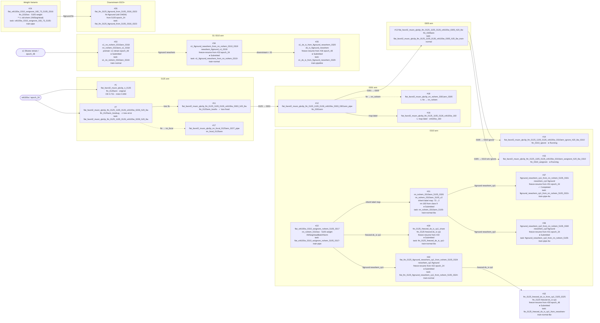

# Experiment Evolution Tree

```mermaid
graph LR
    ROOT(["s4t100w / epoch_24"])
    S1ROOT(["s1 5frame retrain / epoch_48"])

    subgraph "0125 ann"
        direction TB
        F1["#1 flat_favs42_muon_qkclip_n_0125<br/>ftn_0125ann · original<br/>OD 0.731 · mIoU 0.650"]
        F7["#7 flat_favs42_muon_qkclip_ftn_0125_1105_0126_s4t100w_0226_h20_8w<br/>ftn_0125ann_lossbug · ⚠ loss error<br/>task: flat_favs42_muon_qkclip_ftn_0125_1105_0126_s4t100w_0226_h20_8w"]
        F11["#11 flat_favs42_muon_qkclip_ftn_0125_1105_0126_s4t100w_0303_h20_8w<br/>ftn_0125ann_lossfix · ✓ loss fixed"]
        F17["#17 flat_favs42_muon_qkclip_nn_focal_0125ann_0227_pipe<br/>nn_focal_0125ann"]
        F7 -->|"loss fix"| F11
        F7 -.->|"ftn → nn_focal"| F17
    end

    subgraph "0301 ann"
        direction TB
        F12["#12 flat_favs42_muon_qkclip_ftn_0125_1105_0126_s4t100w_0303_0301ann_pipe<br/>ftn_0301ann"]
        F18["#18 flat_favs42_muon_qkclip_nn_nohem_0301ann_0305<br/>↳ ftn → nn_nohem"]
        F16["#16 flat_favs42_muon_qkclip_ftn_0125_1105_0126_s4t100w_160<br/>↳ map label · s4t100w_160"]
    end

    subgraph "0305 ann"
        direction TB
        F13["#13 flat_favs42_muon_qkclip_ftn_0125_1105_0126_s4t100w_0305_h20_8w<br/>ftn_0305ann<br/>task: flat_favs42_muon_qkclip_ftn_0125_1105_0126_s4t100w_0305_h20_8w_train-normal"]
    end

    subgraph "0310 ann"
        direction TB
        F14["#14 flat_favs42_muon_qkclip_ftn_0125_1105_0126_s4t100w_0310ann_ignore_h20_8w_0310<br/>ftn_0310_ignore · ● Running"]
        F15["#15 flat_favs42_muon_qkclip_ftn_0125_1105_0126_s4t100w_0310ann_woignore_h20_8w_0310<br/>ftn_0310_woignore · ● Running"]
        F22["#22 flat_s4t100w_0310_woignore_nohem_5105_0317<br/>nn_nohem_0310wo · 5105 weight<br/>XMSegHeadBatchNorm<br/>task: flat_s4t100w_0310_woignore_nohem_5105_0317-train-pipe"]
        F30["#30 flat_ftn_0125_ftground_newohem_cp1_from_nohem_5105_0324<br/>newohem_cp1 ftground<br/>freeze-resume from #22 epoch_24<br/>● Submitted<br/>task: flat_ftn_0125_ftground_newohem_cp1_from_nohem_5105_0324-train-normal"]
        F37["#37 ftground_newohem_cp1_from_nn_nohem_5105_0331<br/>newohem_cp1 ftground<br/>freeze-resume from #31 epoch_24<br/>✓ Completed<br/>task: ftground_newohem_cp1_from_nn_nohem_5105_0331-train-pipe-4w"]
        F36["#36 ftground_newohem_cp2_from_nn_nohem_5105_0330<br/>newohem_cp2 ftground<br/>freeze-resume from #31 epoch_24<br/>● Submitted<br/>task: ftground_newohem_cp2_from_nn_nohem_5105-train-pipe-4w"]
        F29["#29 ftn_0125_freezed_ds_is_cp1_share<br/>ftn_0125 freezed ds_is cp1<br/>freeze-resume from #22<br/>● Submitted<br/>task: ftn_0125_freezed_ds_is_cp1-train-normal-8w"]
        F31["#31 nn_nohem_0310ann_5105_0326<br/>nn_nohem_0310ann_5105_v2<br/>inherit label map: 73→2<br/>rm 160 from class 9<br/>● Submitted<br/>task: nn_nohem_0310ann_5105-train-normal-8w"]
    end

    subgraph "S1 0310 ann"
        direction TB
        F33["#33 s1_nn_nohem_0310ann_0318<br/>nn_nohem_0310ann_s1_0318<br/>pretrain: s1 retrain epoch_48<br/>● Submitted<br/>task: s1_nn_nohem_0310ann_0318-train-normal"]
        F34["#34 s1_ftground_newohem_from_nn_nohem_0310_0319<br/>newohem_ftground_s1_0319<br/>freeze-resume from #33 epoch_24<br/>● Submitted<br/>task: s1_ftground_newohem_from_nn_nohem_0310-train-normal"]
        F35["#35 s1_ds_is_from_ftground_newohem_0320<br/>ds_is_ftground_newohem<br/>freeze-resume from #34 epoch_48<br/>● Submitted<br/>task: s1_ds_is_from_ftground_newohem_0320-train-pipeline"]
    end

    subgraph "Weight Variants"
        direction TB
        F24["#24 flat_s4t100w_0310_woignore_160_73_5105_0316<br/>ftn_0310wo · 5105 weight<br/>**⚠ old ohem (XMSegHead)<br/>task: s4t100w_0310_woignore_160_73_5105-train-pipe"]
    end

    subgraph "Downstream 0323+"
        direction TB
        F26["#26 flat_ftn_0125_ftground_from_5105_0316_0323<br/>ftn ftground (old OHEM)<br/>from 5105 epoch_24<br/>task: flat_ftn_0125_ftground_from_5105_0316_0323"]
    end

    F32["#32 ftn_0125_freezed_ds_is_from_cp1_5105_0325<br/>ftn_0125 freezed ds_is cp1<br/>freeze-resume from #30 epoch_48<br/>● Submitted<br/>task: ftn_0125_freezed_ds_is_cp1_from_newohem-train-normal-8w"]

    ROOT --> F1
    ROOT --> F7
    F11 -->|"0125 → 0301"| F12
    F12 -.->|"ftn → nn_nohem"| F18
    F12 -->|"map label"| F16
    F12 -->|"0301 → 0305"| F13
    F13 -->|"0305 → 0310 ignore"| F14
    F13 -->|"0305 → 0310 w/o ignore"| F15
    F24 -->|"ftground ftn"| F26
    F22 -->|"inherit label map"| F31
    F22 -->|"ftground newohem_cp1"| F30
    F31 -->|"ftground newohem_cp1"| F37
    F31 -->|"ftground newohem_cp2"| F36
    F22 -->|"freezed ds_is cp1"| F29
    S1ROOT --> F33
    F33 -.->|"ftground newohem"| F34
    F34 -->|"downstream + IS"| F35
    F30 -->|"freezed ds_is cp1"| F32
```
